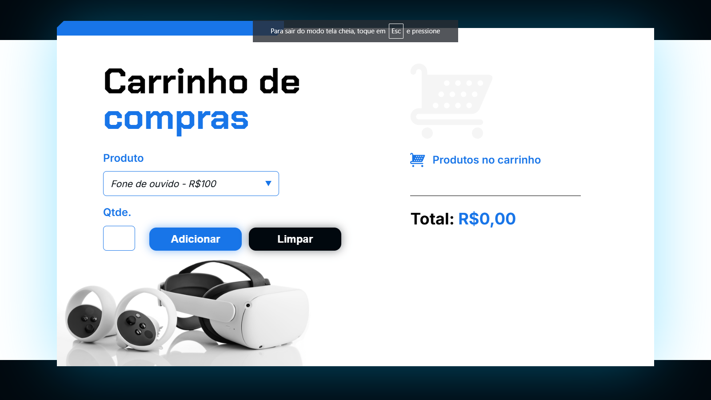

## Desafios: Exercícios
#### Projeto : Carrinho de compras
#### Data : 11/02/2025

#### Formação
[Formação: A partir do zero: iniciante em programação](https://cursos.alura.com.br/formacao-programacao);

#### Curso
[Curso de Lógica de programação: praticando com desafios](https://cursos.alura.com.br/course/logica-programacao-praticando-desafios)

[Link do projeto](https://carrinho-compras-ruddy-one.vercel.app/)